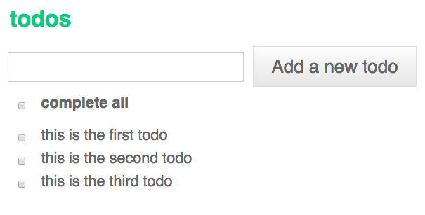

# react-todo

react-todo is a simple todo list component using react.js.



## Installation

`npm install react-todo --save`

## Usage

```javascript
var React = require('react');
var Todo = require('react-todo');
var TODOS = [
  { id: 0, completed: false, title: 'this is the first todo' },
  { id: 1, completed: false, title: 'this is the senond todo' }
];

React.renderComponent(<Todo todos={TODOS} />, document.getElementById("container"));

```

## Styles

react-todo can be used with your own custom styles. A minimal todo.css style sheet is included as a guide.


## Development

Initial set up, run:
    
    npm install

## License

[MIT](http://isekivacenz.mit-license.org/)
